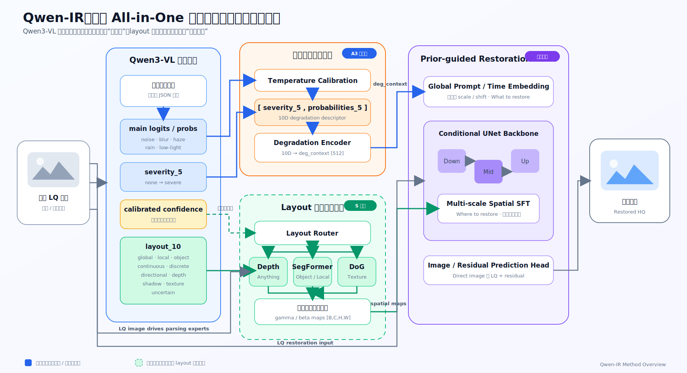

# Qwen-IR

Qwen-IR 是一个面向 All-in-One 图像修复的研究项目：使用 Qwen3-VL 将低质量图像解析为结构化退化先验，再以全局语义条件和 layout 驱动的空间专家共同控制 Conditional UNet 恢复主干。

项目当前已经验证了退化类型概率与严重度先验（A3）的有效性；残差预测（R 系列）、全局 layout FiLM（A5.0）和多尺度空间专家（S 系列）正在按消融计划逐步推进。

> 研究目标不是让 Qwen 直接生成修复图像，而是让大模型回答“发生了什么退化”，再由专门的图像恢复网络回答“如何修复”。

## 方法总览



图中实线表示当前已经实现或验证的主干，绿色虚线表示最终设计中的 layout 空间路由模块。

## 核心思路

整个方法分为四个阶段：

1. **退化理解**：Qwen3-VL 对 LQ 图像进行视觉语言推理，输出结构化退化描述。
2. **全局语义条件**：校准后的退化概率与五类严重度编码为 `deg_context`，告诉 UNet“修什么”。
3. **Layout 空间路由**：layout 属性决定是否调用 depth、segmentation、DoG 等解析专家，告诉 UNet“在哪里修”。
4. **多尺度恢复**：全局 degradation prompt 与空间 SFT 共同调制 Conditional UNet，输出恢复图像或残差。

### 1. StructuredPriorV2

每张图像对应一个命名式结构化先验：

| 字段 | 维度 | 含义 |
|---|---:|---|
| `severity_5` | 5 | noise、blur、haze、rain、low-light 的严重度 |
| `main_logits_5` | 5 | Qwen 对五种主退化候选的原始平均 log-probability |
| `main_probs_5` | 5 | temperature calibration 后的五类概率 |
| `layout_10` | 10 | 全局、局部、物体、方向、深度、阴影、纹理等属性 |
| `raw_margin` | 1 | 原始 top-1 与 top-2 概率差 |
| `calibrated_confidence` | 1 | `max(main_probs_5)`，用于可靠性分析与可选专家路由 |

严重度映射为：

```text
none = 0
mild = 1/3
moderate = 2/3
severe / serious = 1
```

代码仍兼容旧的 21D `prior_vector_21`，但内部逻辑优先使用命名字段，避免依赖脆弱的位置索引。

### 2. Temperature Calibration

Qwen 原始 logits 使用训练集拟合的 temperature 进行校准：

```math
p = \operatorname{softmax}(\ell / T)
```

当前 sample 协议使用 `T = 2.63819562`。校准参数位于：

```text
config/qwen_temperature_0611_sample.json
```

校准不会改变 top-1 类别，但会改善 NLL、ECE、Brier score，并为错误检测和路由提供更合理的置信度。

### 3. 全局退化语义分支

当前验证最充分的 A3 使用：

```text
[severity_5, calibrated probabilities_5]
              ↓
LayerNorm → Linear → GELU → Linear
              ↓
deg_context [B, 512]
```

`deg_context` 不与图像像素直接拼接，而是在当前 Conditional UNet 中转换为 degradation prompt，并加到 timestep embedding：

```math
t' = t + \operatorname{Prompt}(z_{deg})
```

随后，每个 down/mid/up ResBlock 根据 `t'` 产生通道级 scale/shift，从而形成全局退化条件。

这一分支回答：

> 当前是什么退化、每种退化有多大可能、严重程度如何？

### 4. Confidence 的定位

已经完成的 A4-clean 和 A4-corrupt 表明，将 confidence 用于整个 degradation context 的线性插值会损害正确 prior：

```math
z = c z_{Qwen} + (1-c)z_{unknown}
```

因此，该公式不再作为最终主模型的基础条件方式。最终设计保留 A3 的 degradation context，并仅让 confidence 控制可选空间专家：

```math
F_{out} = F_{base} + c \cdot g_{layout} \cdot F_{expert}
```

低 confidence 会关闭额外专家，但不会破坏已经验证有效的 A3 主干。

### 5. Layout 与空间专家

`layout_10` 包含以下属性：

```text
global
local_region
object_specific
continuous
discrete
directional
depth_dependent
shadow_dependent
texture_dependent
uncertain
```

最终空间路由计划为：

| 专家 | Layout gate | 输出 |
|---|---|---|
| Depth Anything | `depth_dependent` | 深度相关空间图 |
| SegFormer | `max(local_region, object_specific)` | 区域/物体 mask |
| DoG | `max(texture_dependent, directional, discrete)` | 纹理与方向响应图 |

当 `uncertain=true` 时，所有可选空间专家 gate 设为0。

专家输出不会再次做空间均值池化，而是生成多尺度 `[B,C,H,W]` gamma/beta map，通过 SFT 调制 UNet feature：

```math
F' = F \odot (1 + \gamma) + \beta
```

A5.0 首先验证 global layout FiLM 是否有效；只有通过该闸门后，才进入真正的空间专家实验。

### 6. Image 与 Residual 输出

项目支持两种 Direct-GT 参数化：

```yaml
prediction_target: image
```

```math
\hat I = f_\theta(I_{LQ}, prior)
```

以及：

```yaml
prediction_target: residual
```

```math
\hat I = I_{LQ} + f_\theta(I_{LQ}, prior)
```

Residual 模式在计算 loss 前不会 clamp；只有保存图像和计算指标时才限制数值范围。Checkpoint 会记录 `prediction_target`，测试配置与 checkpoint 语义不一致时会直接报错。

## 当前实验结果

以下为各实验 `best.pt` 在 fixed 5-task × 40 benchmark（旧目录名 `fixed_tpgdiff_5x40`，共200张）上的中间结果：

| ID | 条件 | Macro PSNR | SSIM |
|---|---|---:|---:|
| A0 | Plain UNet | 22.091 | 0.7529 |
| A0z | Learned constant / zero input prior | 21.638 | 0.7518 |
| A1 | Oracle type + fixed severity | **23.509** | 0.7632 |
| A2 | Calibrated Qwen probabilities | 22.954 | 0.7510 |
| A3 | A2 + severity_5 | 23.249 | **0.7639** |
| A4-clean | A3 + whole-context confidence gate | 23.052 | 0.7550 |

这些结果支持三点阶段性结论：

- Oracle prior 明显优于 plain UNet，证明恢复网络能够利用结构化退化条件。
- Qwen probabilities 与 severity 均提供正增益，A3 是当前推荐主干。
- Whole-context confidence blend 总体负收益，因此 confidence 改为只控制可选专家。

这些数字来自单 seed、200张固定测试集，仅用于中间消融判断；正式结论仍需完整验证集、3 seeds 和 paired bootstrap 95% CI。

## 实验系列

| 系列 | 用途 | 配置目录 |
|---|---|---|
| G | 单任务与数值链路 sanity check | `config/train/G/`、`config/test/G/` |
| A | Direct-image prior 消融 | `config/train/A/`、`config/test/A/` |
| R | A0–A3 的 residual 对照 | `config/train/R/`、`config/test/R/` |
| A5.0 | A3 + global layout FiLM | 待实现 |
| S | 控制集与多尺度空间专家 | `config/train/S/`、`config/test/S/` |

R 系列与 A 系列对应关系：

```text
R0 ↔ A0
R1 ↔ A1
R2 ↔ A2
R3 ↔ A3
```

除 `prediction_target`、实验名和输出目录外，对应配置保持一致。

配置目录的完整说明见 [config/README.md](config/README.md)，实验决策和闸门见 [实施计划.md](实施计划.md)。

## 快速开始

### 环境

先进入项目并安装依赖（PyTorch/torchvision 建议按本机 CUDA 版本单独安装）：

```bash
cd /path/to/Qwen_IR
python -m pip install -r requirements.txt
```

### 训练 A3

```bash
CUDA_VISIBLE_DEVICES=4 PYTHONUNBUFFERED=1 \
python \
script/train_assess_tpgd.py \
--config config/train/A/A3.yml
```

### 训练 Residual 对照

单独运行 R3：

```bash
CUDA_VISIBLE_DEVICES=0 PYTHONUNBUFFERED=1 \
python \
script/train_assess_tpgd.py \
--config config/train/R/R3.yml
```

自动串行运行 R1 → R2 → R3：

```bash
QWEN_IR_GPU=0 bash script/run_train_sequence.bash
```

串行脚本采用 fail-fast：前一个任务成功完成后才启动下一个；任何任务失败都会停止队列并保留日志。

### 测试 best.pt

```bash
CUDA_VISIBLE_DEVICES=0 PYTHONUNBUFFERED=1 \
python \
script/test_assess_tpgd.py \
--config config/test/A/A3.yml \
--checkpoint /path/to/best.pt \
--split val \
--batch-size 32 \
--max-batches 0 \
--output-json log/A3_fixed5x40_metrics.json
```

如果测试 residual checkpoint，必须使用对应的 `config/test/R/*.yml`。

### 运行单元测试

```bash
python -m pytest -q tests
```

## 项目结构

```text
Qwen_IR/
├── config/
│   ├── train/                 # G/A/R/S 训练配置
│   ├── test/                  # G/A/R/S 测试配置
│   └── qwen_temperature_0611_sample.json
├── docs/assets/               # README 与论文草图资产
├── module/
│   ├── backbone/              # Conditional UNet wrapper
│   ├── degradation_prompt/    # severity/probability encoder
│   ├── layout_prompt/         # StructuredPriorV2 与 layout adapter
│   ├── pipeline/              # 数据、训练、验证、测试流程
│   ├── qwen/                  # Qwen structured-prior 导出
│   ├── runtime/               # 在线推理适配器
│   └── vendor/tpgdiff/        # 内置 Conditional UNet/SDE 兼容运行源码
├── script/
│   ├── train_assess_tpgd.py
│   ├── test_assess_tpgd.py
│   ├── run_train_sequence.bash
│   └── calibrate_qwen_prior.py
├── tests/                     # schema、prior、confidence、residual 测试
├── log/                       # 指标、恢复图与队列日志
└── 实施计划.md
```

## 数据与缓存

训练和正式验证数据不包含在仓库中，路径由 YAML 指定。当前主要使用：

```text
/data/chenzt/Dataset/sample/Train
/data/chenzt/Dataset/sample/Val
/data/chenzt/Dataset/Qwen3VL/0611_sample
```

训练阶段允许缓存 Qwen JSON；正式在线评测需要关闭 JSON cache，完整执行：

```text
Qwen preprocessing/generation/scoring
→ calibration
→ optional spatial experts
→ restoration
```

所有正式 run 应保存 config、seed、checkpoint、逐图指标、Qwen 输出、路由权重和运行时间。

## 当前状态与路线图

- [x] Plain UNet Direct-GT baseline
- [x] StructuredPriorV2 与旧 21D 兼容
- [x] Temperature calibration 与置信度统计
- [x] Oracle / Qwen probabilities / severity 消融
- [x] Clean 与 corruption confidence gate 负结果分析
- [x] Image / residual prediction target
- [ ] R0–R3 完整 residual 对照
- [ ] A5.0：A3 + global layout FiLM
- [ ] 局部/复合退化控制集
- [ ] Depth/SegFormer/DoG 多尺度空间专家
- [ ] 3-seed 与 paired bootstrap 95% CI
- [ ] 在线延迟、显存和失败率评估

## 设计约束

- 当前主干固定为 Conditional UNet，不在本轮同时更换 Restormer/NAFNet。
- 主结论优先建立在 Direct-GT 配对指标上，SDE 和真实图像作为补充。
- A5.0 与空间专家必须以 A3 或通过验证的 residual 主干为基线，不能建立在失败的 A4 whole-context gate 上。
- Layout 的有效性必须通过 zero、random、within-task shuffled 和 oracle layout 对照证明。

## 第三方代码说明

当前 `ConditionalUNet` 实现改编自 TPGDiff 源码，但 Qwen-IR 的 Direct-GT 主实验不使用其原始 prior stage、CLIP degradation prior、SDE 训练目标或采样流程，因此整体方法不称为 TPGDiff。为保证仓库可独立执行，所需的 Conditional UNet、可选 IRSDE、Lion、structure prior 和旧版在线推理兼容源码已迁入 `module/vendor/tpgdiff/`；不再依赖本机的 MyFusion、RAR 或 DepictQA 源码目录。第三方归属、裁剪范围及上游许可证问题见 `module/vendor/tpgdiff/NOTICE.md` 与 `module/vendor/tpgdiff/LICENSE`。
